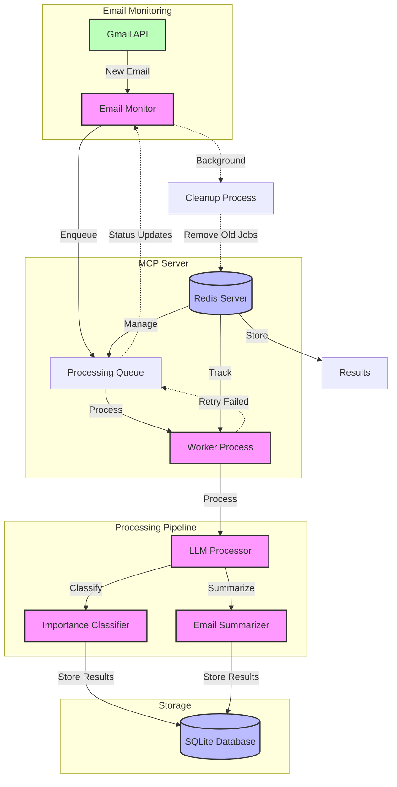
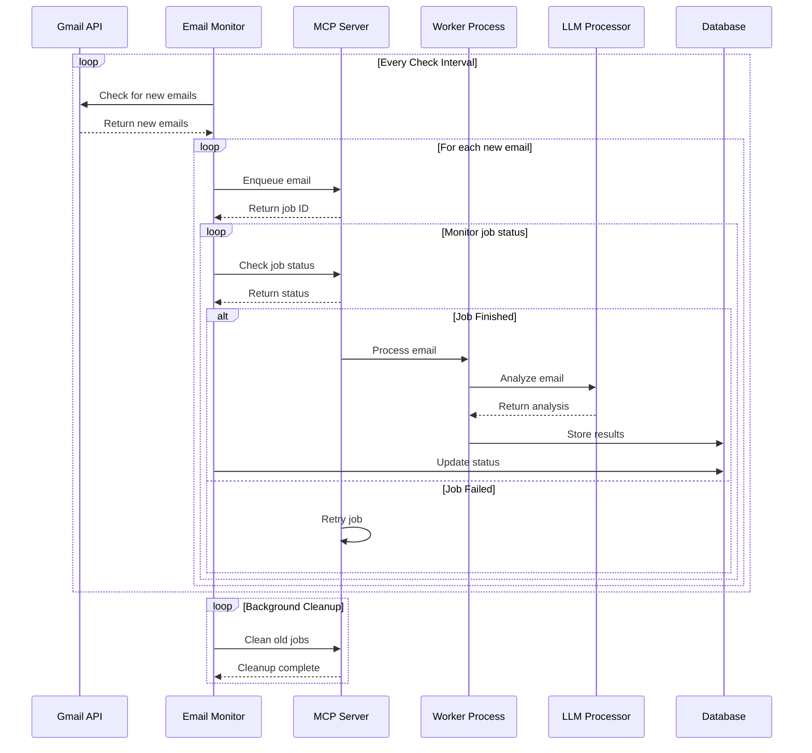

# Email Agent Workflow

## System Architecture

## Detailed Processing Flow

## Component Responsibilities

### Email Monitor
- Polls Gmail API for new emails
- Enqueues emails for processing
- Monitors job status
- Manages background tasks

### MCP Server
- Manages job queues
- Tracks job status
- Handles job retries
- Maintains processing statistics

### Worker Process
- Processes queued emails
- Manages LLM interactions
- Handles error recovery
- Updates job status

### LLM Processor
- Classifies email importance
- Generates email summaries
- Handles model-specific logic

### Database
- Stores processed results
- Maintains email history
- Tracks processing status 